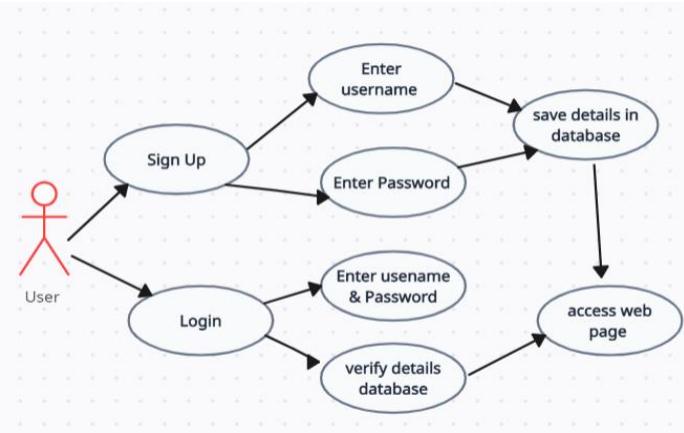
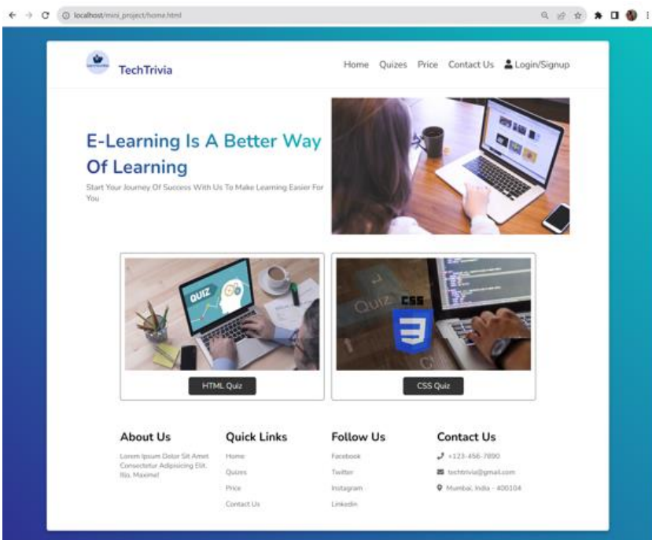
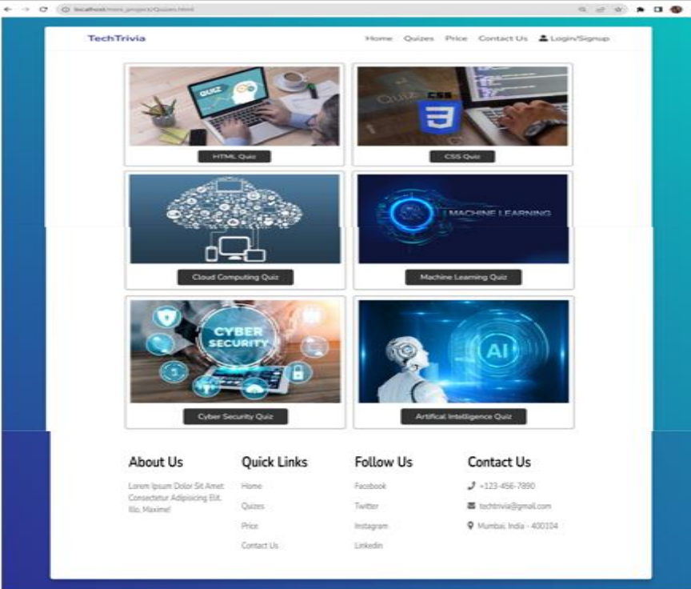
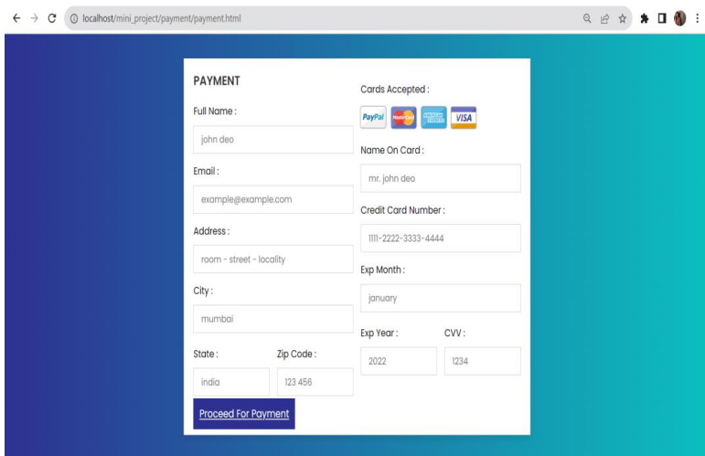
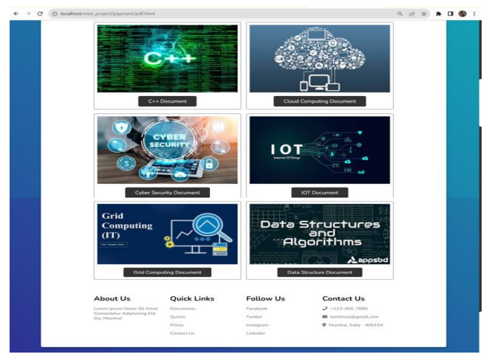
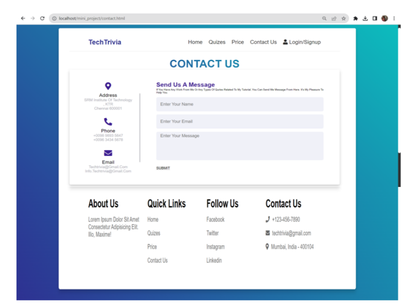

# 📚 Interactive E-Learning Website

## 🚀 Overview

This is a **web-based interactive E-learning application** designed to offer an engaging and educational learning experience. The platform provides secure user authentication, a variety of quizzes, and a **payment gateway** for accessing premium quizzes, documents, and videos.

## 🌟 Features

- ✅ **User Authentication** – Secure login & account creation.
- 🧠 **Interactive Quizzes** – Timed quizzes with real-time scoring.
- 📄 **Premium Content** – Access structured documents & videos.
- 💳 **Payment Gateway** – Unlock premium quizzes & learning materials.
- 🎯 **Performance Tracking** – Get feedback on quiz performance.

## 🛠️ Technologies Used

- **Frontend**: HTML, CSS, JavaScript  
- **Backend**: PHP  
- **Database**: MySQL  
- **Authentication**: PHP Sessions  
- **Payment Integration**: PayPal / Stripe (Optional)  

## System Design

## ScreenShot

